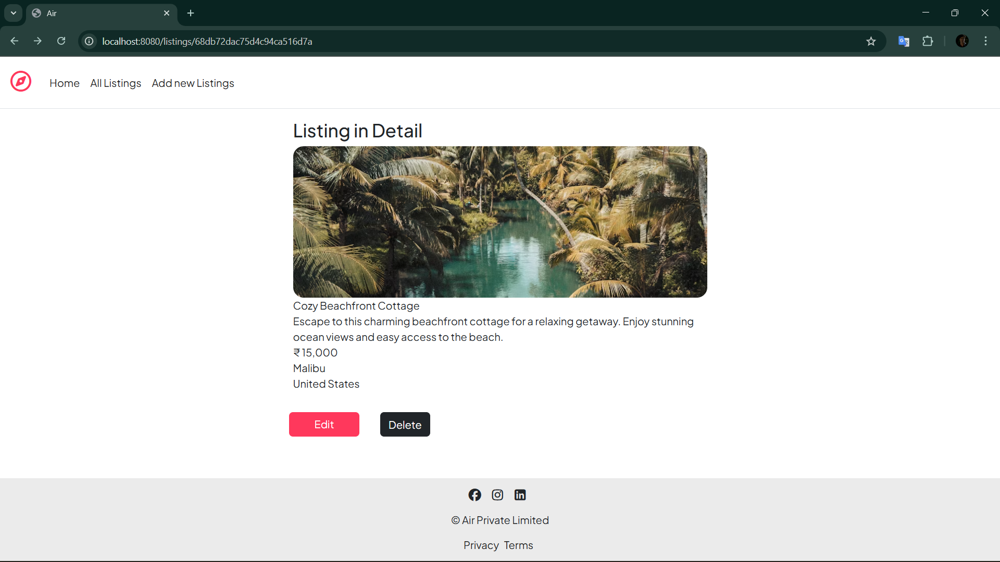
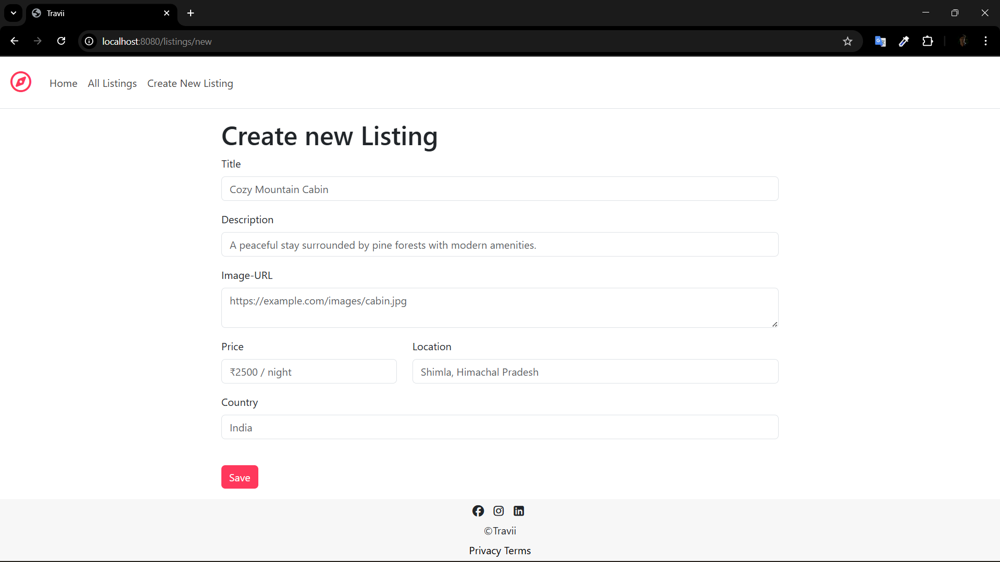
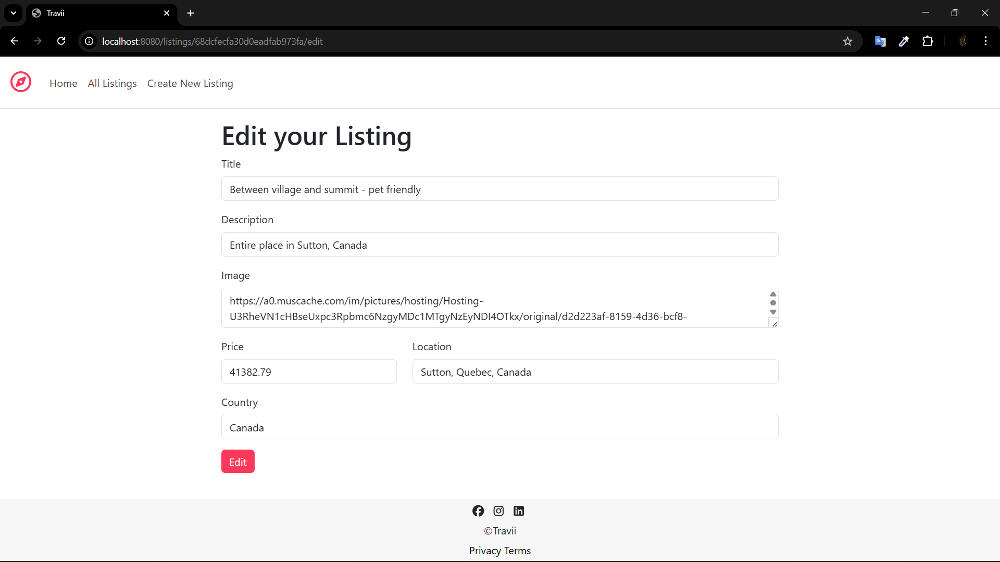

# 🏡 Travii – Vacation Rental Platform

Travii is a modern, full-stack **vacation rental platform** where users can **discover, book, and manage stays** across the world.  
The goal of Travii is to make travel **simpler, smarter, and more accessible**.

---

## 🌟 Features

- 🔑 **User Authentication** – Secure signup/login system  
- 🏠 **Property Listings** – Hosts can create and manage listings  
- 🔍 **Smart Search & Filters** – Location, price, amenities, availability  
- 📅 **Booking System** – Real-time reservation & availability check  
- ⭐ **Reviews & Ratings** – Guests can share their experiences  
- 📱 **Responsive Design** – Works seamlessly on desktop & mobile  

---

## 💻 Tech Stack

- **Frontend:** React.js, Tailwind CSS  
- **Backend:** Node.js, Express.js  
- **Database:** MongoDB  
- **Authentication:** JWT / OAuth  
- **Deployment:** Vercel / Render / AWS  

---

## 🎨 Screenshots

| Home Page | Listings Page | Booking Page |
|-----------|---------------|--------------|
|  |  |  |
|  |
*(Replace with your real screenshots once ready)*

---

## 🚀 Getting Started

To run Travii locally:

```bash
# Clone repo
git clone https://github.com/yourvinii/travii.git

# Install dependencies
cd travii
npm install

# Start backend
npm run server

# Start frontend
npm start
